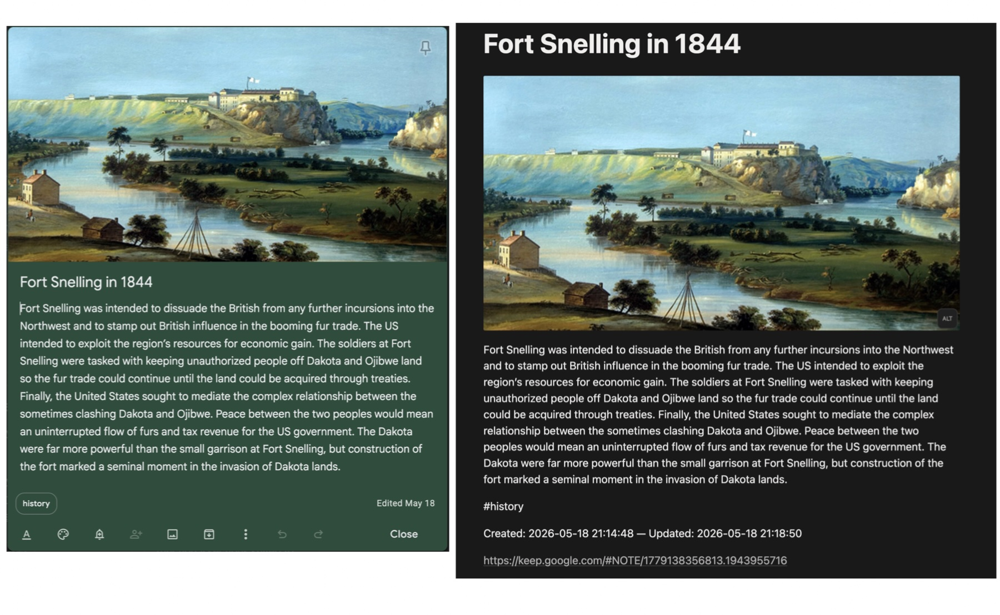

## Notion Conversion

### Overview
KIM can now export markdown files in a compatible format for Notion import. Notion has issues importing markdown files with media links unless the markdown and media are wrapped into a zip file. A new switch has been added (`-no`) to export in this special format. Once exported from Keep using the `-no` option you must then use the "Settings / Import" menu option in the Notion UI to import the ZIP file successfully. 

### Steps for Migrating to Notion
  (be sure to run a test on a small set of notes first!)
- Run KIM tests (examples `python kim.py -no -b #arthistory` or `python kim.py -no -cd "> 2026-01-01"`). Just be sure to use the `-no` option - see EXAMPLES.md
- Open the Notion app and select "Settings" and the "Import" menu - then choose the main "Import your content to Notion" option
- The exported zipped Notion markdown files will be in the same folder level as your output_path called `notion/keepexport.zip`
- Select the single zip file in Notion using "choose a file" (you can ignore "Text & Markdown")
- Run the import in Notion
- All markdown files will end up in the Notion sidebar menu under the `keepexport` folder

**NOTE! When you run Notion export, none of the existing files in the export folder are deleted first so that the zip file will contain everything exported and what was there before. Be sure to move or delete anything you don't want in the export folder first before you export for Notion.**

If you want to export all your Keep notes (run both `python kim.py -no -d -b --all` and `python kim.py -no -d -a -b --all` to export both active and archive (`-a`) notes). The `-d` option removes duplicate labels in notes - e.g., if you have both #mytag in the note and the label 'mytag' as well. Once you do both the Notion zip file will contain both.

All image media types should transfer (images and drawings). Audio files will import but you must download the audio to your device to play them. Reminders, active tags (hashtags will still be present), note-to-note links, formatted text and note colors do not transfer (reminder notes will transfer - just not the actual Tasks)

### Examples

**Keep Note and Imported Notion Note**

